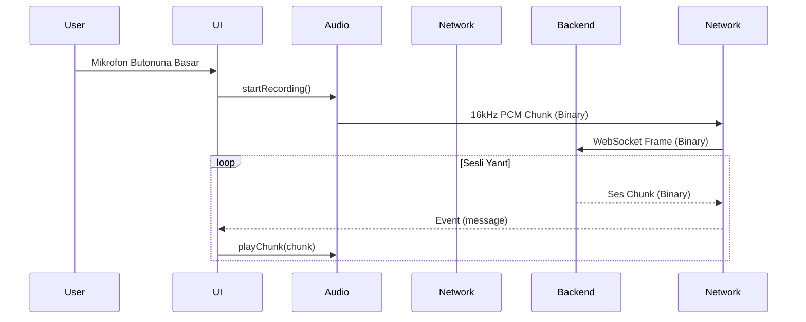

# 🧠 Sentiric Assistant - Mantık ve Akış Mimarisi

Bu uygulama, 3 ana katman üzerine kurulmuştur: **UI**, **Audio Service** ve **WebSocket Service**.

## 1. Veri Akış Döngüsü

## 2. Mimari Kararlar

-   **Client-Side Resampling:** Kullanıcının mikrofonundan gelen ses, hangi örnekleme oranında olursa olsun, uygulama içinde `mic_stream` paketi aracılığıyla **16kHz**'e düşürülür. Bu, `stream-gateway` üzerindeki işlem yükünü ortadan kaldırır ve bant genişliğinden tasarruf sağlar.
-   **Jitter Buffer:** `HomeScreen` içinde tutulan `_audioQueue`, `StreamGateway`'den gelen ses paketlerini biriktirir. Ağda oluşabilecek anlık gecikmeler (jitter), bu tampon sayesinde kullanıcıya kesintisiz bir ses deneyimi olarak yansıtılır.
-   **Dinamik Konfigürasyon:** WebSocket adresi `.env` dosyasından okunur. Bu sayede aynı kod tabanı, farklı sunucu ortamlarına (dev, test, prod) kolayca bağlanabilir.
